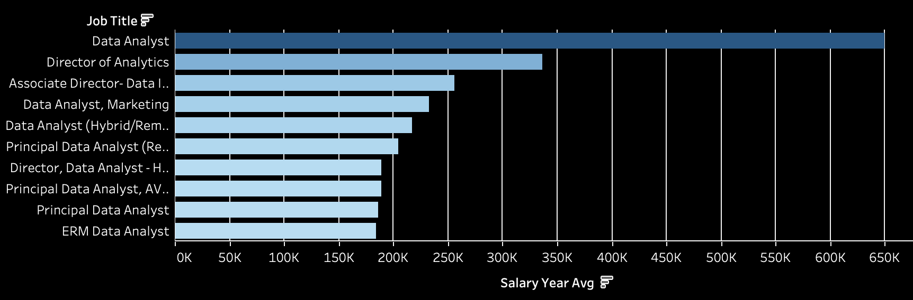
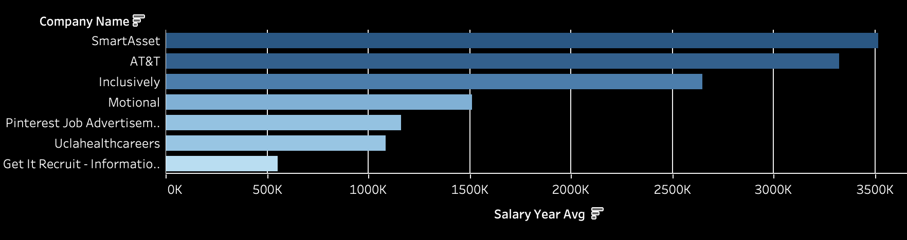

# What are the most optimal skills for a Data Analyst? 

## Introduction
This project analyzes the data job market to uncover insights about the Data Analyst role — specifically focusing on:

💰 Top-paying positions within the field

🧠 Most in-demand skills that employers are looking for

⚖️ The intersection of high demand and high salary, highlighting the most valuable skills to learn

Using real job posting data, this analysis identifies trends that help aspiring and current data professionals understand which skills drive both job security and financial growth. The findings are particularly focused on remote roles with disclosed salaries, providing a clear, data-driven view of the opportunities in today’s market.

SQL queries? Check them out here: [project_sql folder](/project_sql/)
## Background
This project was created as the capstone for Luke Barousse’s Data Analyst SQL course, where I’ve been developing my skills in writing and optimizing SQL queries. As part of my learning journey, I wanted to apply those skills to a real-world question — identifying the most in-demand and highest-paying skills for my dream career as a Data Analyst. 

Through this project, I combined technical learning with career exploration, using data to uncover which skills truly make a difference in the job market.

### The questions I wanted to answer through my SQL queries were: 
1. What are the top-paying data analyst jobs?
2. What skills are required for the top-paying data analyst jobs?
3. What are the most in-demand skills for remote data analyst jobs?
4. What are the top skills based on salary?
5. What are the most optimal skills to learn (both in high demand and high pay)?

## Tools I Used
For my deep dive into the data analyst job market, I harnessed the power of several key tools:

- **SQL** — The backbone of this analysis, used to query, clean, and extract key insights from the dataset.

- **PostgreSQL** — The database management system of choice, providing a robust environment for handling and analyzing job posting data.

- **Visual Studio Code** — The primary development environment used to write and execute SQL queries efficiently.

- **Git & GitHub** — Essential for version control, documentation, and sharing code, ensuring smooth collaboration and project transparency.

- **Tableau** - Used to create interactive graphs and charts, turning raw query results into clear, visual insights that make trends, top-paying jobs, and in-demand skills easy to understand at a glance.
## The Analysis
Each query for this project aimed at investigating specific aspects of the data analyst job market. Here's how I approached the question:

### 1. Top Paying Data Analyst Jobs
To identify the highest paying roles, I filtered data analyst positions by average yearly salary and location, focusing on remote jobs. The query highlights the high paying opportunities in the field. 

```sql
SELECT
    company_dim.name AS company_name,
    job_title,
    job_location,
    job_schedule_type,
    salary_year_avg,
    job_posted_date::DATE
FROM 
    job_postings_fact
LEFT JOIN company_dim ON
    job_postings_fact.company_id = company_dim.company_id   
WHERE 
    job_title_short = 'Data Analyst'
    AND job_location = 'Anywhere'
    AND salary_year_avg IS NOT NULL
ORDER BY 
    salary_year_avg DESC
LIMIT 10;
```


*Bar graph visualizing the salary for the top 10 salaries for data analysts; graph generated with Tableau*

### 2. Required Skills for Data Analyst Jobs
After identifying the highest-paying positions, I explored the specific skills required for those roles. This query connects each top-paying job to its associated skill set, revealing the technical abilities most valued by employers offering the best salaries.

```sql
WITH top_paying_jobs AS (
    SELECT
        job_id,
        company_dim.name AS company_name,
        job_title,
        salary_year_avg
    FROM job_postings_fact
    LEFT JOIN company_dim 
        ON job_postings_fact.company_id = company_dim.company_id
    WHERE 
        job_title_short = 'Data Analyst'
        AND job_location = 'Anywhere'
        AND salary_year_avg IS NOT NULL
    ORDER BY 
        salary_year_avg DESC
    LIMIT 10
)
SELECT 
    t.*,
    s.skills
FROM top_paying_jobs AS t
INNER JOIN skills_job_dim AS sj
    ON t.job_id = sj.job_id
INNER JOIN skills_dim AS s
    ON sj.skill_id = s.skill_id
    WHERE s.skills IS NOT NULL
ORDER BY t.salary_year_avg DESC, s.skills;
```


*Bar graph visualizing the salary for the skills **required** for data analysts; graph generated with Tableau*


### 3. Top In-Demand Skills for Data Analyst Jobs
To uncover which skills appear most frequently in job postings, I counted how often each skill was listed across all Data Analyst roles. The results highlight the tools and technologies that are most consistently sought after in the market.

``` sql
SELECT 
    skills,
    COUNT(skills_job_dim.job_id) AS demand_count
FROM job_postings_fact
INNER JOIN skills_job_dim
    ON job_postings_fact.job_id = skills_job_dim.job_id
INNER JOIN skills_dim
    ON skills_job_dim.skill_id = skills_dim.skill_id
WHERE
    job_postings_fact.job_title_short = 'Data Analyst' 
GROUP BY skills
ORDER BY demand_count DESC
LIMIT 5
```

| Skill    | Demand Count |
|----------|-------------|
| SQL      | 92,628      |
| Excel    | 67,031      |
| Python   | 57,326      |
| Tableau  | 46,554      |
| Power BI | 39,468      |

### 4. Top Paying Skills for Data Analyst Jobs
This query focuses on financial value — calculating the average salary associated with each skill. By analyzing compensation data, it identifies which technical skills tend to command the highest pay among Data Analyst positions.

``` sql
SELECT 
    skills,
    ROUND(AVG(salary_year_avg), 2) AS avg_salary
FROM 
    skills_dim
INNER JOIN skills_job_dim
    ON skills_dim.skill_id = skills_job_dim.skill_id
INNER JOIN job_postings_fact
    ON skills_job_dim.job_id = job_postings_fact.job_id
WHERE
    job_postings_fact.job_title_short = 'Data Analyst' AND
    job_postings_fact.salary_year_avg IS NOT NULL 
    -- job_work_from_home = True
GROUP BY skills
ORDER BY avg_salary DESC
LIMIT 25
```

| Skill           | Avg Salary ($) |
|-----------------|----------------|
| **SVN**             | **400,000.00**     |
| **Solidity**        | **179,000.00**     |
| **Couchbase**       | **160,515.00**     |
| **DataRobot**       | **155,485.50**     |
| **Golang**          | **155,000.00**     |
| MXNet           | 149,000.00     |
| dplyr           | 147,633.33     |
| VMware          | 147,500.00     |
| Terraform       | 146,733.83     |
| Twilio          | 138,500.00     |
| GitLab          | 134,126.00     |
| Kafka           | 129,999.16     |
| Puppet          | 129,820.00     |
| Keras           | 127,013.33     |
| PyTorch         | 125,226.20     |
| Perl            | 124,685.75     |
| Ansible         | 124,370.00     |
| Hugging Face    | 123,950.00     |
| TensorFlow      | 120,646.83     |
| Cassandra       | 118,406.68     |
| Notion          | 118,091.67     |
| Atlassian       | 117,965.60     |
| Bitbucket       | 116,711.75     |
| Airflow         | 116,387.26     |
| Scala           | 115,479.53     |

### 5. The Most Optimal Skills for Data Analyst Jobs
Combining both demand and salary metrics, this analysis pinpoints the most strategically valuable skills — those that are not only highly sought after but also pay well. These represent the best opportunities for aspiring analysts to invest their learning efforts for maximum career growth.

``` sql
SELECT 
    skills_dim.skill_id,
    skills_dim.skills,
    COUNT(skills_job_dim.job_id) AS demand_count,
    ROUND(AVG(job_postings_fact.salary_year_avg), 2) AS avg_salary
FROM 
    job_postings_fact
INNER JOIN skills_job_dim
    ON job_postings_fact.job_id = skills_job_dim.job_id
INNER JOIN skills_dim
    ON skills_job_dim.skill_id = skills_dim.skill_id
WHERE
    job_postings_fact.job_title_short = 'Data Analyst'
    AND job_postings_fact.salary_year_avg IS NOT NULL
    AND job_postings_fact.job_work_from_home = TRUE
GROUP BY 
    skills_dim.skill_id,
    skills_dim.skills
HAVING COUNT(skills_job_dim.job_id) > 10
ORDER BY avg_salary DESC, demand_count DESC
LIMIT 25;
```
| Skill ID | Skill        | Demand Count | Avg Salary ($) |
|----------|--------------|-------------|----------------|
| 1        | **Python**      | **236**       | **101,397.22**     |
| 182      | **Tableau**     | **230**       | **99,287.65**      |
| 5        | **R**           | **148**       | **100,498.77**     |
| 186      | **SAS**         | 63            | 98,902.37          |
| 7        | SAS            | 63            | 98,902.37          |
| 185      | Looker         | 49            | 103,795.30         |
| 80       | Snowflake      | 37            | 112,947.97         |
| 79       | Oracle         | 37            | 104,533.70         |
| 74       | Azure          | 34            | 111,225.10         |
| 76       | AWS            | 32            | 108,317.30         |
| 8        | Go             | 27            | 115,319.89         |
| 97       | Hadoop         | 22            | 113,192.57         |
| 233      | Jira           | 20            | 104,917.90         |
| 4        | Java           | 17            | 106,906.44         |
| 78       | Redshift       | 16            | 99,936.44          |
| 197      | SSRS           | 14            | 99,171.43          |
| 2        | NoSQL          | 13            | 101,413.73         |
| 77       | BigQuery       | 13            | 109,653.85         |
| 187      | Qlik           | 13            | 99,630.81          |
| 92       | Spark          | 13            | 99,076.92          |
| 13       | C++            | 11            | 98,958.23          |
| 234      | Confluence     | 11            | 114,209.91         |
| 61       | SQL Server     | 35            | 97,785.73          |
| 9        | JavaScript     | 20            | 97,587.00          |

Here's a breakdown of the most optimal skills for Data Analysts in 2023:

- **High-Demand Programming Languages:** Python and R stand out for their high demand, with demand counts of 236 and 148 respectively. Despite their high demand, their average salaries are around $101,397 for Python and $100,499 for R, indicating that proficiency in these languages is highly valued but also widely available.
- **Cloud Tools and Technologies:** Skills in specialized technologies such as Snowflake, Azure, AWS, and BigQuery show significant demand with relatively high average salaries, pointing towards the growing importance of cloud platforms and big data technologies in data analysis.
- **Business Intelligence and Visualization Tools:** Tableau and Looker, with demand counts of 230 and 49 respectively, and average salaries around $99,288 and $103,795, highlight the critical role of data visualization and business intelligence in deriving actionable insights from data.
-**Database Technologies:** The demand for skills in traditional and NoSQL databases (Oracle, SQL Server, NoSQL) with average salaries ranging from $97,786 to $104,534, reflects the enduring need for data storage, retrieval, and management expertise.
## What I Learned
Throughout this journey, I’ve exponentially leveled up my SQL skills:

🧩 **Complex Query Crafting** – I can now join tables like a pro and use WITH clauses to create powerful temporary tables that make even tricky analyses manageable.

📊 **Data Aggregation** – I’ve gotten comfortable with GROUP BY and turned functions like COUNT() and AVG() into my go-to tools for summarizing data.

💡 **Analytical Problem-Solving** – I’ve sharpened my ability to tackle real-world questions, transforming them into actionable insights through well-crafted SQL queries.

## Conclusions
From digging into the data, a few key takeaways really stand out:

**Top-Paying Data Analyst Jobs:** Remote-friendly data analyst roles can pay anywhere from solid to jaw-dropping — with the highest hitting $650,000!

**Skills for Top-Paying Jobs:** To land those top-dollar gigs, advanced SQL skills are non-negotiable — it’s clearly a salary-driving superpower.

**Most In-Demand Skills:** SQL isn’t just high-paying; it’s also the skill employers are hunting for most, making it essential for anyone entering the field.

**Skills with Higher Salaries:** Niche expertise like SVN and Solidity commands a premium, showing that specialized skills can really set you apart.

**Optimal Skills for Market Value:** SQL shines at the sweet spot of demand and pay, cementing its status as a must-learn skill to maximize your value as a data analyst.

## Closing Thoughts
This project not only leveled up my SQL skills but also uncovered some real insights into the data analyst job market. The results act as a roadmap for prioritizing which skills to learn and where to focus job search efforts. By zeroing in on high-demand, high-paying skills, aspiring data analysts can better stand out in a competitive market. This work also underscores the importance of staying curious, continuously learning, and keeping up with emerging trends in the world of data analytics.